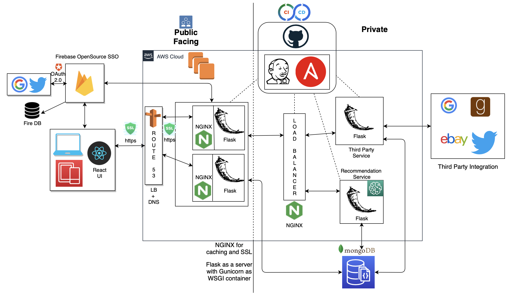

# Integrated Management System to Improve Library Experiences
Developed an end-to-end application having microservice architecture deployed on AWS to improve user experiences.

•	Created application using React, Flask, and MongoDB with SSO authentication providing automation, unit testing, and performance monitoring with Jenkins, Ansible, JEST, and JMeter deploying services to EC2 instances

•	Enhanced application with third-party APIs, recommendation system using collaborative filtering, and routing traffic from AWS Route 53 to ELB load balancer for maximizing speed and capacity utilization

### High Level Architecture Diagram

### Tools and Technologies Used:
1. REACT
2. NodeJS
3. FIREBASE SSO
4. FLASK
5. NGINX
6. ANSIBLE
7. Amazon Web Services
8. GOOGLE BOOKS API
9. TWITTER API
10. JENKINS
11. MONGODB
12. GITHUB
13. Jmeter

